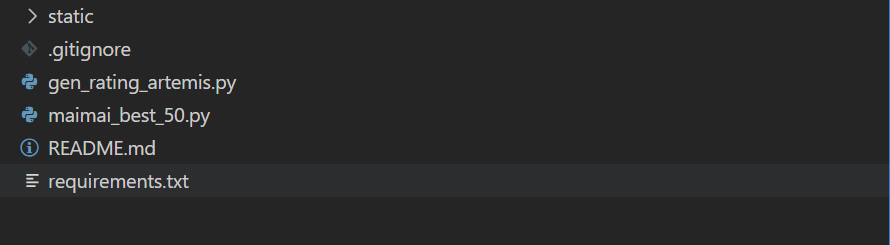

### ARTEMIS Maimai B50 Generator

This is a simple tool for B50 (Best 50 scores) generator for those who use [ARTEMIS](https://gitea.tendokyu.moe/Hay1tsme/artemis) as their maimai server.


> Sample image


#### To Use:

Make sure you are able to access the Artemis server. (At least READ access)

1. Assume Python environment is set up correctly (recommend to use venv), install dependencies

   ```shell
   pip install -r /path/to/requirements.txt
   ```

2. Download [image and font resources](https://www.diving-fish.com/maibot/static.zip), extract the folder with below hierarchy 
3. Change parameters in `gen_rating_artemis.py`
   * database host / password
   * artemis game version
   * user_id
4. Run `gen_rating_artemis.py`
   * by default the result image is under the root folder


#### Ref:

https://github.com/Diving-Fish/mai-bot

https://gitea.tendokyu.moe/Hay1tsme/artemis